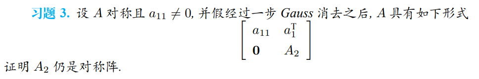
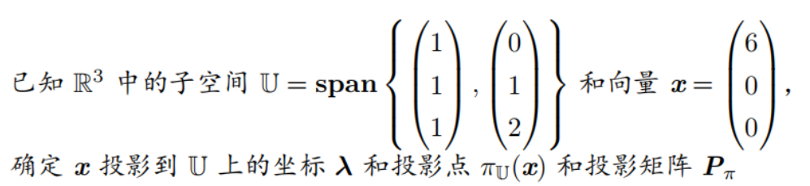
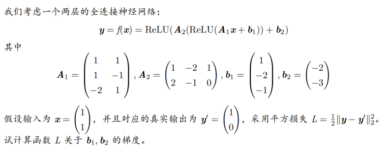
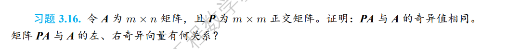
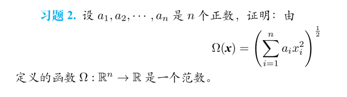
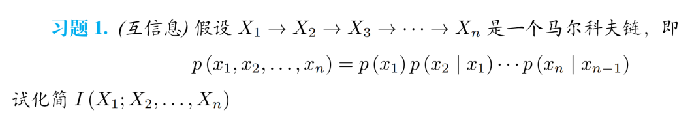

## 《数据科学与工程数学基础》2023-2024-1期末试卷

2024年1月11日13:00-15:00

## 题目1

（1）对矩阵进行LU分解

$$\begin{pmatrix}
5&3&-1&3\\
0&1&1&-2\\
-5&-3&4&-4\\
0&1&1&0\\
\end{pmatrix}$$

其实这是个作业原题

（2）其实也是个作业原题

## 题目2

和课件上这个很类似，但是数据有变化，而且是5维的，难度不大。（子空间是5×2，x是5×1的）

## 题目3

（1）$f(x)=a^Tx,g(x)=x^TAx$求这两个函数的Hessian矩阵

（2）和课件上的基本类似，但是参数可能不同，甚至式子都一模一样。

## 题目4

（1）已知$M$的SVD分解$M=U\sum V^T$,求$A=[M \ M]$的SVD

（2）

这个题比较滑稽，在2023年hdj的最新版教材上的课后习题

## 题目5

（1）给了一个矩阵（大概3×2的矩阵，都是整数）然后求他的1范数和$\infin$范数

（2）证明$||A||^2_{F}=\sum_{i=1}^{n}||a_i||^2_{F}$

（3）又是一个作业题

## 题目6

（1）又是一个作业题

（2）$X,Y$为取值$\{0,1,2,3\}$的独立同分布（等概率）求$H(X+Y)$

## 题目7

（1）求$xlog_2x$的共轭函数

（2）用拉格朗日乘子法求欠定方程$Ax=b$的最小二范数解，其中$A\in R^{m×n},m\leq{n},rank(A)=m$

## 题目8

（1）使用梯度下降法和固定步长$\lambda=0.01$计算$min f(x)=(x_1-1)^2+16(x_2-2)^2$,初始点$x^{(0)}=(2,3)^T$,迭代三步后终止

（2）写出牛顿法与BFGS的区别和联系